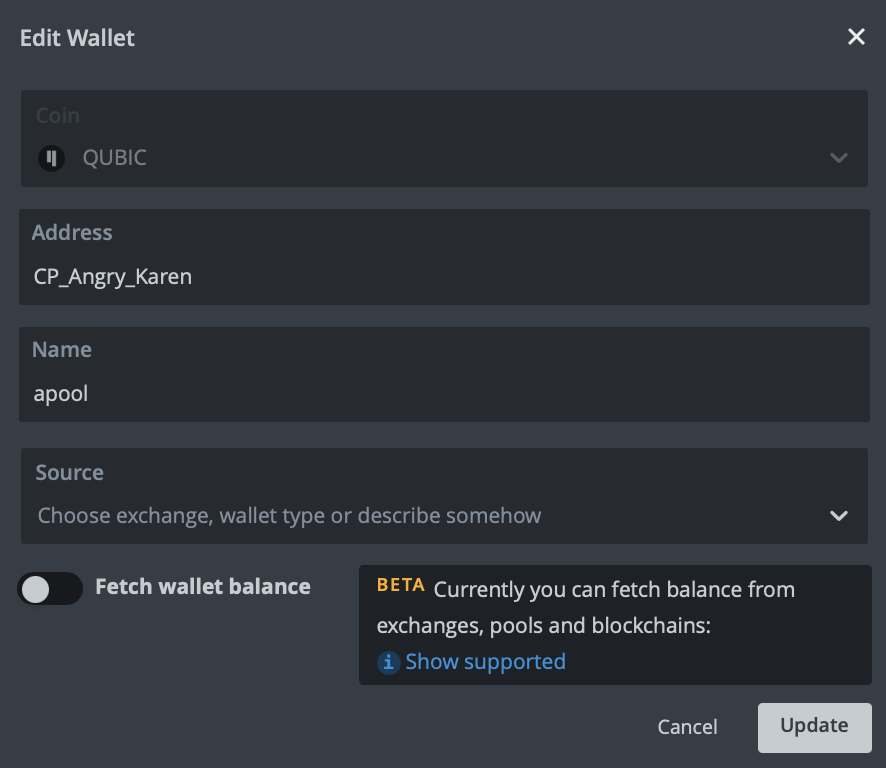
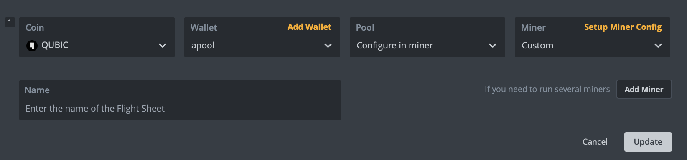
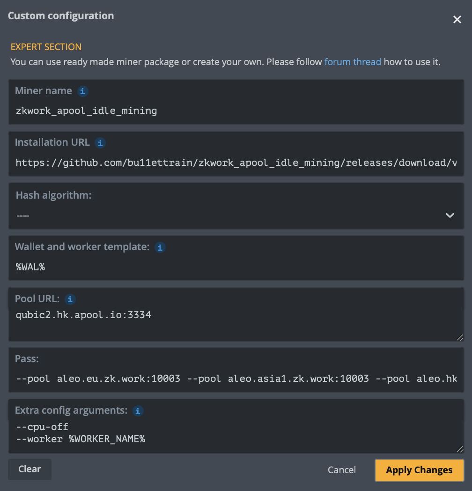

# ALEO + QUBIC Idle Mining on ZK.Work + apool.io

### HiveOS:

1. Add **QUBIC** wallet in HiveOS

2. Add and setup new Flight sheet

* Miner name: `zkwork_apool_idle_mining`
* Installation URL: `https://github.com/bu11ettrain/zkwork_apool_idle_mining/releases/download/v1.06/zkwork_apool_idle_mining-v1.06_hiveos.tar.gz`
* Wallet and worker template:`%WAL`
* Pool URL：`qubic2.hk.apool.io:3334`
* Extra Config Arguments: `--worker %WORKER_NAME% --cpu-off`
* Pass：`--pool aleo.eu.zk.work:10003 --pool aleo.asia1.zk.work:10003 --pool aleo.hk.zk.work:10003 --pool aleo.jp.zk.work:10003 --custom_name %WORKER_NAME% --address aleoxxx`

Don't forget to replace `aleoxxx` with your **ALEO** wallet address.

### Linux:
1. Download and unpack the latest build for Linux from [Releases](https://github.com/bu11ettrain/zkwork_apool_idle_mining/releases): \
   `wget https://github.com/bu11ettrain/zkwork_apool_idle_mining/releases/download/v1.06/zkwork_apool_idle_mining-v1.06_linux.tar.gz` \
   `tar -xzvf zkwork_apool_idle_mining-v1.06_linux.tar.gz`
2. Modify config file miner.conf: \
   For example: 
   >algo=qubic \
   account=**CP_Angry_Karen** \
   pool=qubic1.hk.apool.io:3334 \
   worker=**fckn_slave** \
   cpu-off=true \
   #thread=4 \
   #gpu-off=false \
   #gpu=0,1,2 \
   third_miner="aleo_prover" \
   third_cmd="./aleo_prover --pool aleo.eu.zk.work:10003 --pool aleo.asia1.zk.work:10003 --pool aleo.hk.zk.work:10003 --pool aleo.jp.zk.work:10003 --custom_name **fckn_slave** --address **aleoxxx**"
3. Run script: \
   `nohup bash run.sh > run.log 2>&1 &`
4. View miner log: \
   `tail -f aleo_prover.log` \
   `tail -f qubic.log`
5. Shutdown run.sh script and miners: \
   `ps aux|grep -w "run.sh"|grep -v grep|grep -v nohup|awk '{print $2}'|xargs kill -9` \
   `killall -9 zkminer` \
   `killall -9 apoolminer`

